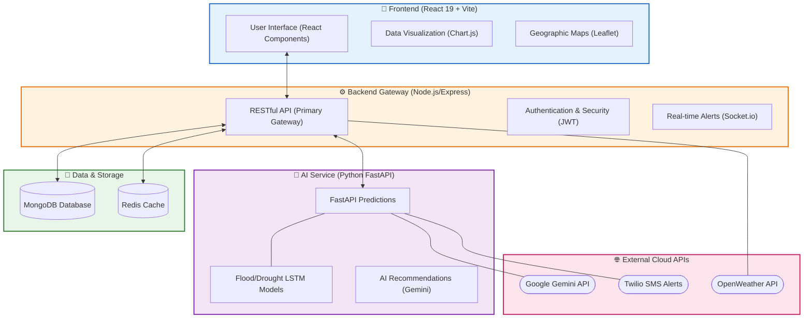

# 🚀 AgriUrbanAI - Team Vitality

**AgriUrbanAI** is an AI-powered platform designed for smart agriculture and urban planning. It provides real-time weather monitoring, flood/drought risk forecasting, and AI-driven recommendations to help farmers and urban planners make data-informed decisions.

---

## 🛠️ Architecture & Tech Stack

This project uses a hybrid microservice architecture to balance real-time web responsiveness with complex AI computations.

### **Flowchart**

### **Core Technologies**

**Frontend**
*   **React 19**: Modern UI library for a responsive dashboard.
*   **Vite**: Fast build tool for optimized performance.
*   **Vanilla CSS**: For precise, premium aesthetics.
*   **Chart.js**: For visualizing weather and prediction data.
*   **Leaflet**: For spatial and geographic mapping.

**Backend**
*   **Node.js / Express**: Primary API and security gateway.
*   **FastAPI (Python)**: High-performance microservice for AI model inference.
*   **Socket.io**: Powers real-time alerting systems.
*   **JWT & BcryptJS**: Standardized secure authentication.

**AI & Machine Learning**
*   **Google Gemini Pro**: Generative AI for tailored agricultural recommendations.
*   **TensorFlow (LSTM)**: Time-series forecasting for flood and drought risk.
*   **Scikit-learn**: Data preprocessing and modeling.

**Database & Infrastructure**
*   **MongoDB**: Primary NoSQL persistence layer.
*   **Redis**: High-speed caching (optional/scaling).
*   **Capacitor**: Cross-platform mobile (Android) deployment support.
*   **Twilio**: Automated SMS emergency alert integration.

---

## 🚀 Getting Started

1.  **Environment Setup**: Copy `.env.example` to `.env` in the `backend/` folder and add your API keys.
2.  **Install Dependencies**:
    *   Root: `npm install`
    *   Frontend: `cd frontend && npm install`
    *   Python AI Service: `cd backend && pip install -r requirements.txt`
3.  **Run Development**:
    *   Backend: `npm run dev`
    *   Frontend: `npm run frontend-dev` (if configured) or `cd frontend && npm run dev`
    *   AI Service: `cd backend && uvicorn main:app --reload`

---

## 📄 License

This project is licensed under the MIT License - see the LICENSE file for details.
